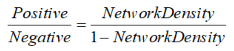

## **Network-Specific Data Partitioning and Sampling**

Given the significant differences in the number of edges among different network types across datasets, we further calculated the density of each corresponding network, defined as the ratio of actual edges to the maximum possible edges (see **Table 1**). Based on the density metric, we divided the four types of networks into two groups and applied tailored evaluation strategies to more comprehensively reflect the model’s adaptability and performance under different network structures.

For the first group, we used datasets from the STRING, Non-Specific, and LOF/GOF networks. All TF-gene pairs with regulatory relationships were grouped according to their TFs. For each TF, its regulated target genes were randomly split into training and testing sets in a 2:1 ratio, with one-fifth of the training set further held out as a validation set. This TF-based splitting strategy ensures that some regulatory relationships of the same TF appear in the training set while others remain in the testing set, thus more accurately assessing the model’s generalization ability to unseen regulatory relationships.

Regarding negative sample construction, all TF-gene pairs not present in the label files were treated as candidate negative samples. To improve the model’s discrimination between positive and negative relations, a “hard negative sampling” strategy was employed in the training set: for each positive pair (TFa,Gene_b), a negative pair (TFa,Gene_c) was randomly matched, where Gene_c  is not known to be regulated by TFa, ensuring a 1:1 positive-to-negative sample ratio. The validation set adopted the same strategy to randomly match corresponding negative pairs. In contrast, the number of negative samples in the test set was dynamically determined according to the target network’s density, making the test set construction better reflect the structural distribution of real regulatory networks. The formula is as follows:

 

In the second part, focusing on cell type-specific networks, although the network density is relatively high and there are sufficient positive samples, the number of active transcription factors (TFs) in each network is comparatively small. To ensure the model can fully learn the features of each TF, we split all positive samples of each TF into training, validation, and test sets with proportions of 67%, 10%, and 23%, respectively. Similarly, the potential negative samples corresponding to each TF were divided according to the same proportions, maintaining the integrity of the sample distribution and adapting to the characteristics of high-density networks. This approach facilitates training and evaluation of the model under realistic data distributions.

Table 1 The statistics of four ground-truth networks with TFs and 500 (1000) most-varying genes

|   Cell types   |   Cells   |    STRING    |           |               |              | Non-Specific |            |            |              |
| :------------: | :-------: | :----------: | :-------: | :-----------: | :----------: | :----------: | :--------: | :--------: | :----------: |
|                |           |   **TFs**    | **Genes** |   **Edges**   | **Density**  |   **TFs**    | **Genes**  | **Edges**  | **Density**  |
|      hESC      |    758    |   343(351)   | 511(695)  |  4257(5149)   | 0.024(0.021) |   283(292)   | 753(1138)  | 3441(4617) | 0.016(0.014) |
|      hHEP      |    425    |   409(414)   | 646(874)  |  7523(9003)   | 0.028(0.024) |   322(332)   | 825(1217)  | 4129(5351) | 0.015(0.013) |
|      mDC       |    383    |   264(273)   | 479(664)  |  4815(5898)   | 0.038(0.032) |   250(254)   |  634(969)  | 3067(3918) | 0.019(0.016) |
|      mESC      |    421    |   495(499)   | 638(785)  |  7762(8479)   | 0.024(0.021) |   516(522)   | 890(1214)  | 6893(8030) | 0.015(0.013) |
|     mHSC-E     |   1071    |   156(161)   | 291(413)  |  1371(1826)   | 0.029(0.027) |   144(147)   |  442(674)  | 1425(1960) | 0.022(0.020) |
|    mHSC-GM     |    889    |   92(100)    | 201(344)  |   748(1311)   | 0.040(0.037) |    82(88)    |  297(526)  | 743(1358)  | 0.030(0.029) |
|     mHSC-L     |    847    |    39(40)    |  70(81)   |   137(154)    | 0.048(0.045) |    35(37)    |  164(192)  |  279(317)  | 0.048(0.043) |
| **Cell types** | **Cells** | **Specific** |           |               |              | **LOF/GOF**  |            |            |              |
|                |           |   **TFs**    | **Genes** |   **Edges**   | **Density**  |   **TFs**    | **Genes**  | **Edges**  | **Density**  |
|      hESC      |    758    |    34(34)    | 815(1260) |  4545(7084)   | 0.164(0.165) |      -       |     -      |     -      |      -       |
|      hHEP      |    425    |    30(31)    | 874(1331) |  9939(15558)  | 0.379(0.377) |      -       |     -      |     -      |      -       |
|      mDC       |    383    |    20(21)    | 443(684)  |   756(1193)   | 0.085(0.082) |      -       |     -      |     -      |      -       |
|      mESC      |    421    |    88(89)    | 977(1385) | 29,613(42795) | 0.345(0.347) |   34 (34)    | 774 (1098) | 4169(5742) | 0.158(0.154) |
|     mHSC-E     |   1071    |    29(33)    | 691(1177) | 11,557(21975) | 0.578(0.566) |      -       |     -      |     -      |      -       |
|    mHSC-GM     |    889    |    22(23)    | 618(1089) |  7364(14135)  | 0.543(0.565) |      -       |     -      |     -      |      -       |
|     mHSC-L     |    847    |    16(16)    | 525(640)  |  4398(5180)   | 0.525(0.507) |      -       |     -      |     -      |      -       |