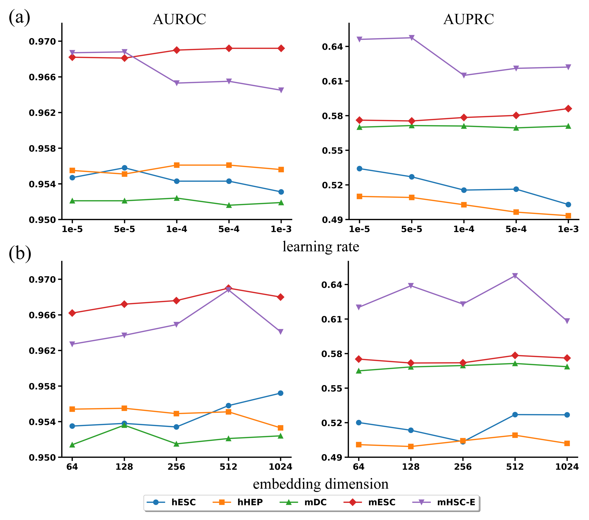

## **Case study**

Table 1  Top 20 TF–gene pairs from three TFs in the hESC 500 dataset

| TF   | Target  |   Evidence   |  TF   | Target  |   Evidence   |   TF   | Target  |   Evidence   |
| ---- | :-----: | :----------: | :---: | :-----: | :----------: | :----: | :-----: | :----------: |
| EGR1 | TFAP2A  | Ground-truth | NANOG |  DCLK1  | Ground-truth | TFAP2A |  JUND   | Ground-truth |
| EGR1 |  JUND   | Ground-truth | NANOG |  KLF7   | Ground-truth | TFAP2A | SEMA6A  | Ground-truth |
| EGR1 |  TRAF6  | Ground-truth | NANOG |  NCAM1  | Ground-truth | TFAP2A | HNRNPD  | Ground-truth |
| EGR1 | ARFGAP3 | Ground-truth | NANOG |  PALLD  | Ground-truth | TFAP2A |  NCAM1  | Ground-truth |
| EGR1 |  SALL2  | Ground-truth | NANOG | DEPDC1B | Ground-truth | TFAP2A |  TBX3   | Ground-truth |
| EGR1 |  PHB2   | Ground-truth | NANOG |  MAML3  | Ground-truth | TFAP2A |  SALL2  | Ground-truth |
| EGR1 | BCLAF1  | Ground-truth | NANOG | ZNF165  | Unconfirmed  | TFAP2A |  WDFY1  | Ground-truth |
| EGR1 | RBFOX2  | Ground-truth | NANOG |   ID1   | Ground-truth | TFAP2A |  SNRPB  | Ground-truth |
| EGR1 |  NUP54  | Ground-truth | NANOG |   TNC   | Ground-truth | TFAP2A |  MSX1   | Ground-truth |
| EGR1 |  FOXN3  | Ground-truth | NANOG | PTPRZ1  | Ground-truth | TFAP2A |  FUBP1  | Ground-truth |
| EGR1 | SLC19A2 | Unconfirmed  | NANOG |  MECOM  | Ground-truth | TFAP2A |  SIRT1  | Ground-truth |
| EGR1 |  PTMA   | Ground-truth | NANOG | SEMA6A  | Ground-truth | TFAP2A |  PALLD  | Ground-truth |
| EGR1 |  IFI16  | Ground-truth | NANOG | C4orf46 | Ground-truth | TFAP2A |  ENC1   | Ground-truth |
| EGR1 |  MDM4   | Ground-truth | NANOG | RBFOX2  | Ground-truth | TFAP2A | EEF1A1  | Ground-truth |
| EGR1 |  TEAD4  | Ground-truth | NANOG |  TRAF6  | Unconfirmed  | TFAP2A | ZNF202  | Ground-truth |
| EGR1 |   ID1   | Ground-truth | NANOG |  ETV4   | Ground-truth | TFAP2A | RHOBTB3 | Ground-truth |
| EGR1 | GABRB3  | Ground-truth | NANOG |  E2F3   | Unconfirmed  | TFAP2A | GATAD2A | Ground-truth |
| EGR1 |  PLK2   | Ground-truth | NANOG |  KLHL4  | Ground-truth | TFAP2A |  PGM2   | Ground-truth |
| EGR1 | HNRNPD  | Ground-truth | NANOG |  AFF4   | Ground-truth | TFAP2A |  DUSP4  | Ground-truth |
| EGR1 |  XRCC5  | Ground-truth | NANOG | ANKRD28 | Ground-truth | TFAP2A |  AFF4   | Ground-truth |

Table  2  Top 20 TF–gene pairs from two TFs in the hESC 500 dataset

|  TF   |  Target  |   Evidence   |  TF  |  Target  |   Evidence   |
| :---: | :------: | :----------: | :--: | :------: | :----------: |
| TEAD4 |  TFAP2A  | Ground-truth | OTX2 |  TFAP2A  | Ground-truth |
| TEAD4 |  RGPD2   | Ground-truth | OTX2 |  FOXN3   | Ground-truth |
| TEAD4 |  TRAF6   | Ground-truth | OTX2 |   SOX2   | Ground-truth |
| TEAD4 |  KIF15   | Ground-truth | OTX2 |  CAMK2D  | Ground-truth |
| TEAD4 |  POLR2A  | Ground-truth | OTX2 | PRICKLE1 | Ground-truth |
| TEAD4 |   AFF1   | Ground-truth | OTX2 |   ZNF8   | Unconfirmed  |
| TEAD4 |  INSIG2  | Ground-truth | OTX2 | ARHGAP42 | Ground-truth |
| TEAD4 |  CXXC1   | Ground-truth | OTX2 | ARHGAP28 | Ground-truth |
| TEAD4 |   PAWR   | Ground-truth | OTX2 |  YPEL5   | Ground-truth |
| TEAD4 |   RMI1   | Ground-truth | OTX2 |  ESRP1   | Ground-truth |
| TEAD4 |  WDR12   | Unconfirmed  | OTX2 | ANKRD13C | Ground-truth |
| TEAD4 |  SNRPB   | Ground-truth | OTX2 |  ZNF589  | Ground-truth |
| TEAD4 |   ASNS   | Ground-truth | OTX2 |  CCPG1   | Ground-truth |
| TEAD4 |  NFAT5   | Ground-truth | OTX2 |   JUND   | Unconfirmed  |
| TEAD4 |  CEP55   | Ground-truth | OTX2 |  ZNF165  | Ground-truth |
| TEAD4 |  SIRT1   | Ground-truth | OTX2 | FAM117B  | Ground-truth |
| TEAD4 | PRICKLE1 | Ground-truth | OTX2 |   TNC    | Ground-truth |
| TEAD4 |   MIA3   | Ground-truth | OTX2 |  SRSF1   | Ground-truth |
| TEAD4 |  HMGN2   | Unconfirmed  | OTX2 |  KAT6A   | Ground-truth |
| TEAD4 |  ZNF142  | Unconfirmed  | OTX2 |  KLHL24  | Ground-truth |

## **Hyperparameter tuning**

The performance of NP-MCGRN was affected by several key hyperparameters. Among them, node embedding dimension and learning rate had direct effects on representation capacity and training stability. We tuned these hyperparameters on benchmark scRNA-seq datasets constructed from STRING networks, using AUROC and AUPRC as the primary evaluation metrics. All candidate configurations used the same data splits, negative-sample construction strategy and training procedure as the main experiments. The test sets were not used for hyperparameter selection.

We first examined the effect of learning rate on model performance. The candidate learning rates ranged from1×10-5 to 1×10-3. As shown in Fig. 1a, NP-MCGRN maintained stable AUROC values across different learning rates. The AUROC varied only slightly across the five STRING datasets, indicating that the model’s discriminative ability was not highly sensitive to learning-rate changes. By contrast, AUPRC was more sensitive to the learning rate. Larger learning rates reduced AUPRC, especially on the hESC, hHEP and mHSC-E datasets. This result indicates that overly large parameter updates may weaken the model’s ability to rank high-confidence regulatory edges in class-imbalanced GRN inference tasks. In comparison, 1×10-5 and 5×10-5 achieved more balanced performance on most datasets. Among them, 5×10-5 produced the highest mean AUROC and maintained near-optimal AUPRC. Therefore, 5×10-5 was used as the default learning rate in subsequent experiments to balance training stability and edge-ranking performance.

We then evaluated the effect of node embedding dimension on model representation capacity. As shown in Fig. 1b, increasing the embedding dimension from 64 to 512 improved AUROC and AUPRC on most datasets. This trend indicates that higher-dimensional latent representations helped capture complex gene regulatory relationships. In particular, 512-dimensional embeddings achieved better overall performance on the mESC and mHSC-E datasets, suggesting that an appropriate increase in representation capacity strengthened the modelling of latent regulatory structures in STRING networks. However, further increasing the embedding dimension to 1024 did not produce continued improvement, and AUPRC decreased on some datasets. This result may indicate that excessively high embedding dimensions introduce redundant representations and increase the model’s dependence on the training graph structure, thereby reducing generalization on validation data. Considering both AUROC and AUPRC, 512-dimensional node embeddings showed the most stable performance across the five datasets and were selected as the default embedding dimension for the main experiments.

Fig. 1. Hyperparameter analysis results. Effects of learning rate (a) and node embedding dimension (b) on NP-MCGRN performance.

Overall, the hyperparameter tuning results show that NP-MCGRN maintained stable discriminative performance across a relatively wide learning-rate range. Its edge-ranking ability depended more strongly on a conservative learning rate and a moderate representation dimension. The final configuration, with a learning rate of 5×10-5 and 512-dimensional node embeddings, achieved a favourable balance between performance and stability across different cell-type datasets. This configuration was therefore used consistently in the subsequent comparison experiments, ablation studies and mechanistic analyses.

## **Impact of training dataset size on model stability**

Training data size affects the representation learning capacity of the model and directly influences its stability in sparse regulatory networks. To evaluate the adaptability of NP-MCGRN under different amounts of training data, we selected four representative datasets: the human hESC and hHEP datasets, and the mouse mHSC-E and mHSC-GM datasets. For each dataset, the model was trained with 10%, 20%, 30%, 40% and 50% of the training samples. AUROC and AUPRC were used to evaluate prediction performance.

As shown in Fig. 2, AUROC and AUPRC increased overall across the four datasets as the proportion of training data increased. For AUROC, hESC increased from 0.7009 with 10% training data to 0.8306 with 50% training data. hHEP increased from 0.8011 to 0.8816, mHSC-E increased from 0.8390 to 0.9103, and mHSC-GM increased from 0.8441 to 0.9115. AUPRC showed the same trend. hESC increased from 0.3575 to 0.5351, hHEP increased from 0.7056 to 0.8131, mHSC-E increased from 0.8674 to 0.9284, and mHSC-GM increased from 0.8490 to 0.9226. These results show that more training samples improved both the discriminative ability and edge-ranking ability of the model. The improvement was especially clear in the hESC dataset, which was more sample-sparse and challenging to predict.

Further comparison across training proportions showed that NP-MCGRN already produced usable predictions with only 10% of the training data. This indicates that the model retained a degree of robustness under low-data conditions. Performance improved markedly as the training proportion increased from 10% to 40%. When the proportion further increased from 40% to 50%, the performance gains became smaller across all four datasets. The mean AUROC increased only from 0.8730 to 0.8835, and the mean AUPRC increased from 0.7892 to 0.7998. These results indicate that NP-MCGRN gradually reached stable performance after receiving a moderate amount of training data. The model did not show excessive dependence on large training sets.

Fig. 2. AUROC (a) and AUPRC (b) performance of NP-MCGRN under different training data sizes.

Overall, the training-data-size experiment showed that NP-MCGRN maintained stable GRN inference performance under different data availability conditions. The model preserved basic predictive ability with a low proportion of training samples. As the amount of training data increased, AUROC and AUPRC further improved and gradually converged. These results indicate that NP-MCGRN can adapt to limited labelled data in sparse GRN settings. With more supervision, it further enhanced its ability to model complex regulatory structures.